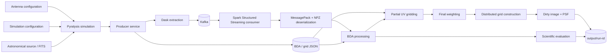

# Thesis AS-IS Architecture

## Purpose

This document describes the architecture of the restored thesis implementation as it currently exists.

It focuses on:

```text
runtime components
data flow
processing boundaries
framework dependencies
configuration coupling
filesystem coupling
known architectural limitations
```

It intentionally does not describe the target v1.0 architecture.

Historical reference: `thesis-original`.

---

## 1. System context

The thesis implementation is a streaming scientific-processing pipeline composed of:

```text
Pyralysis
Dask
Kafka
Spark Structured Streaming
BDA processing
UV gridding
visibility weighting
dirty-image generation
scientific evaluation
filesystem configuration/output
```

The main runtime boundary is formed by two executable services:

```text
Producer
Consumer
```

Kafka separates the two services.

---

## 2. AS-IS pipeline



This represents the recovered implementation rather than a desired future architecture.

---

## 3. Producer boundary

Primary entrypoint:

```text
src/services/producer_service.py
```

The producer has three principal responsibilities:

```text
1. Generate the astronomical dataset.
2. Derive runtime BDA/imaging configuration.
3. Stream visibility data to Kafka.
```

### Simulation

`src/data/simulation.py` directly constructs Pyralysis objects.

The simulation layer therefore depends on:

```text
Pyralysis
Astropy
Dask
NumPy
repository configuration files
astronomical source files
```

No repository-owned visibility-domain representation separates Pyralysis data structures from the producer pipeline.

---

## 4. Producer extraction and serialization

`src/data/extraction.py` directly consumes arrays derived from the Pyralysis dataset.

Its responsibilities include:

```text
Dask materialization
rechunking
baseline-length calculation
visibility block creation
flag conversion
NPZ serialization
MessagePack metadata creation
Kafka publication
end-of-stream publication
```

The same module therefore combines:

```text
data extraction
numerical transformation
serialization
transport
runtime configuration
```

These concerns are not separated by explicit architectural interfaces.

---

## 5. Kafka message boundary

Kafka is the strongest explicit runtime boundary in the recovered architecture.

Each scientific Kafka record consists of:

```text
Kafka key
MessagePack metadata in headers
compressed NPZ numerical payload
```

Metadata includes identifiers and visibility dimensions.

The payload contains:

```text
antenna identifiers
scan number
time
exposure
interval
u/v/w coordinates
visibilities
weights
flags
baseline length
```

The producer also sends the control key:

```text
__END__
```

to indicate the end of the stream.

---

## 6. Kafka coupling

The producer service exposes a bootstrap-server parameter, but `src/data/extraction.py` constructs its Kafka client using:

```text
localhost:9092
```

directly.

The consumer receives its Kafka endpoint through its CLI.

Therefore producer and consumer do not obtain their transport configuration through the same mechanism.

This creates a direct infrastructure assumption inside the producer extraction layer.

---

## 7. Consumer boundary

Primary entrypoint:

```text
src/services/consumer_service.py
```

The consumer coordinates:

```text
Spark session creation
Kafka streaming source
control-message handling
deserialization
Spark DataFrame construction
BDA
partial gridding
final gridding
weighting
grid materialization
dirty-image generation
scientific evaluation
runtime timing
Spark shutdown
```

The consumer is therefore the central orchestration component of the thesis implementation.

---

## 8. Kafka-to-Spark conversion

Kafka records enter the consumer as Spark streaming rows.

The consumer then performs:

```text
Kafka binary record
        |
        v
MessagePack header decoding
        |
        v
NPZ deserialization
        |
        v
Python dictionaries / NumPy arrays
        |
        v
row expansion
        |
        v
Spark DataFrame
```

The visibility schema is declared directly inside `consumer_service.py`.

There is no independent internal visibility model between transport deserialization and Spark processing.

---

## 9. Streaming orchestration

Spark Structured Streaming is configured with:

```text
starting offsets: earliest
fail on data loss: false
maximum offsets per trigger: 300
trigger interval: 60 seconds
```

Each micro-batch is handled through:

```text
foreachBatch
```

The consumer maintains Python lists containing the resulting Spark DataFrames:

```text
grid
averaged
windowed
```

These are accumulated during the lifetime of the streaming query and consolidated after the end-of-stream signal is observed.

---

## 10. BDA processing

The BDA pipeline spans:

```text
src/core/bda/bda_integration.py
src/core/bda/bda_processor.py
src/core/bda/bda_core.py
```

### Distributed orchestration

`bda_integration.py`:

```text
repartitions by baseline_key
sorts within partitions by baseline_key, scan_number and time
invokes the BDA processor
coalesces the averaged result
```

### Window processing

`bda_processor.py` uses Spark grouped Pandas UDF operations to:

```text
group by baseline and scan
assign temporal window IDs
calculate BDA diagnostics
group by baseline, scan and window
perform weighted averaging
propagate flags/weights
```

### Mathematical core

`bda_core.py` contains lower-level calculations such as:

```text
UV distance
phase difference
sinc response
maximum samples per window
```

These functions are more numerically isolated than the surrounding BDA processor, but the complete BDA execution path remains coupled to Spark DataFrames and Pandas UDFs.

---

## 11. BDA bypass

The consumer applies BDA when:

```text
decorr_factor < 1.0
```

Otherwise the original scientific DataFrame is sent directly to gridding.

Scientific BDA evaluation is also skipped when BDA is disabled.

---

## 12. Partial gridding

For each processed micro-batch, the consumer calls:

```text
apply_gridding(..., strategy="PARTIAL")
```

Partial gridding:

```text
duplicates Hermitian UV samples
repartitions visibility data
groups records by baseline
maps visibility/channel/correlation data to UV pixels
emits accumulated pixel contributions
```

The implementation uses:

```text
Spark DataFrames
Pandas
NumPy
Astropy constants
```

Gridding is therefore not framework-independent in the restored architecture.

---

## 13. Final gridding and weighting

After streaming ends, all partial-grid DataFrames are unioned.

The combined DataFrame is repartitioned and processed using:

```text
apply_gridding(..., strategy="COMPLETE")
```

The complete stage applies one of:

```text
NATURAL
UNIFORM
```

weighting.

Both weighting implementations operate directly on Spark DataFrames.

---

## 14. Grid materialization boundary

After weighting, `build_grid()` creates NumPy grid arrays inside Spark partitions.

Each partition produces:

```text
complex visibility grid
weight grid
```

Spark combines these arrays using:

```text
RDD.treeReduce
```

The final:

```text
grid
weights
```

objects are returned to the Spark driver as NumPy arrays.

This marks an important architectural boundary:

```text
distributed Spark processing
        |
        v
driver-resident NumPy grid
```

Dirty-image synthesis therefore no longer executes as distributed Spark processing.

---

## 15. Dirty-image generation

`src/core/imaging/dirty_image.py` receives the final NumPy grids.

It performs:

```text
weight application
FFT shift
FFT
image extraction/cropping
PNG generation
PSF generation
```

using:

```text
NumPy
Matplotlib
cmcrameri
```

Output is written directly to:

```text
./output/<run-id>/
```

The imaging module therefore depends directly on local filesystem paths.

---

## 16. Scientific evaluation

Evaluation spans:

```text
amplitude.py
rms.py
baseline.py
coverage.py
metrics.py
```

The evaluation coordinator receives both:

```text
windowed scientific visibility DataFrame
averaged visibility DataFrame
```

and calculates:

```text
amplitude error
RMS error
baseline-dependent compression
UV-coverage comparisons
```

These implementations operate on Spark DataFrames and write their results directly to the filesystem.

Evaluation is therefore coupled to both:

```text
Spark
output directory layout
```

---

## 17. Configuration flow

Configuration is not purely read-only.

The producer loads:

```text
simulation configuration
BDA configuration
grid configuration
```

and derives values from the generated Pyralysis dataset.

It then writes derived BDA values such as:

```text
lambda_ref
fov
theta_max
threshold
```

back into the BDA JSON file.

It also writes derived imaging values such as:

```text
cellsize
corrs_string
chan_freq
```

back into the grid JSON file.

The consumer later loads those files when the first non-empty streaming micro-batch is processed.

This creates an implicit filesystem-based configuration handoff:

```text
Producer
   |
   | mutates JSON
   v
configuration files
   |
   | read later
   v
Consumer
```

Kafka is therefore not the only communication dependency between producer and consumer.

---

## 18. Filesystem coupling

The restored pipeline assumes repository-relative filesystem locations for:

```text
configuration
astronomical source files
temporary Dask files
Spark checkpoints
logs
result images
result metrics
UV coverage files
baseline summaries
```

Some locations are configurable.

Others are built directly inside the implementation.

Examples include:

```text
./output/<run-id>/
/tmp/spark-bda-...
tmp/dask
```

---

## 19. Runtime architecture

### Local

```text
Host
├── Python / Micromamba
├── Pyralysis
├── local Dask client
├── Spark local runtime
├── Docker Kafka
├── producer
└── consumer
```

### Single-node HPC

```text
SLURM node
├── Singularity Kafka
├── ZooKeeper
├── local Dask client
├── Spark local runtime
├── producer
└── consumer
```

### Multi-node HPC

```text
Master node
├── Spark master
├── Spark driver
├── Kafka
├── ZooKeeper
├── producer
└── local Dask client

Worker nodes
└── Spark worker / executor
```

The producer/Dask side does not scale horizontally together with Spark in the recovered scripts.

---

## 20. Control-flow coupling

The producer terminates its stream by publishing:

```text
__END__
```

The consumer uses that record to decide when to stop Structured Streaming and begin:

```text
final grid consolidation
dirty-image generation
evaluation
```

Therefore final imaging and metrics depend on application-level control signalling over Kafka rather than on an independently bounded batch/experiment object.

The current consumer also returns early when a filtered micro-batch contains no scientific rows.

If an end-of-stream control record arrives by itself, that early return occurs before the shared end state is updated.

This creates a baseline termination edge case.

---

## 21. Driver-side orchestration

The consumer stores Spark DataFrames for all processed micro-batches in Python lists until streaming terminates.

Later it performs unions across those DataFrames.

The final UV grid is then reduced to NumPy arrays returned to the driver.

Consequently, although Spark distributes substantial processing, final orchestration and image synthesis are driver-centric.

This characteristic is relevant when interpreting scalability behavior of the thesis implementation.

---

## 22. Major coupling matrix

| Area               | Coupled to                         | AS-IS consequence                                                          |
| ------------------ | ---------------------------------- | -------------------------------------------------------------------------- |
| Simulation         | Pyralysis                          | Producer source model depends directly on the external astronomy framework |
| Extraction         | Pyralysis/Dask                     | Dataset materialization assumes Pyralysis/Dask structures                  |
| Extraction         | Kafka                              | Transport construction is embedded in data extraction                      |
| Producer transport | `localhost:9092`                   | Kafka location is partially hardcoded                                      |
| Producer/consumer  | JSON filesystem                    | Producer mutates configuration later consumed by Spark                     |
| Consumer           | Spark                              | Streaming orchestration and schema are defined directly in the service     |
| BDA processor      | Spark/Pandas UDF                   | Complete BDA processing cannot run independently of Spark                  |
| Gridding           | Spark/Pandas                       | Gridding logic is tied to distributed DataFrames                           |
| Weighting          | Spark                              | Natural/uniform weighting directly uses Spark aggregations                 |
| Final image        | driver/NumPy                       | Final grid is materialized outside distributed Spark execution             |
| Evaluation         | Spark/filesystem                   | Metrics depend on DataFrames and direct filesystem output                  |
| Outputs            | repository-relative filesystem     | Result persistence is not abstracted                                       |
| HPC runtime        | SLURM/Singularity/path assumptions | Historical scripts encode infrastructure-specific paths                    |

---

## 23. Architectural limitations

The restored architecture has several limitations relevant to later roadmap work.

### Framework-specific scientific processing

Scientific operations and distributed execution concerns are interleaved in several modules.

### No common internal visibility boundary

Visibility data moves from Pyralysis structures to serialized NPZ blocks and then to Spark rows without a repository-owned representation separating those technologies.

### Configuration has side effects

Producer execution modifies configuration files that are subsequently read by the consumer.

### Transport concerns are embedded in extraction

The producer data-extraction module also creates and manages the Kafka client.

### Runtime configuration is inconsistent

Local Compose, historical HPC scripts and Python modules obtain runtime information through different mechanisms.

### Driver-centric final processing

Final grid reduction produces driver-resident arrays before image synthesis.

### Historical script drift

The tracked HPC scripts no longer match current source/configuration paths or current CLI argument names.

### Dependency reproducibility is incomplete

Several packages are unpinned and at least one imported imaging dependency is absent from the declared environment.

### End-of-stream behavior depends on micro-batch composition

A control-only final micro-batch can bypass the state update that terminates the query.

These limitations are observations of the restored implementation.

No corrective architecture is implemented during Phase 0.

---

## 24. What is not represented as current architecture

The following concepts are intentionally not shown as existing components:

```text
generic visibility source interfaces
repository-owned visibility batches
framework-independent complete BDA pipeline
hexagonal ports/adapters
unified experiment configuration
generic persistence adapters
portable runtime abstraction
```

Those concepts belong to later roadmap phases and must not be confused with the thesis baseline.

---

## 25. AS-IS summary

The restored thesis implementation can be summarized as:

```text
Pyralysis
    |
    v
Simulation
    |
    v
Dask materialization
    |
    v
NPZ + MessagePack
    |
    v
Kafka
    |
    v
Spark Structured Streaming
    |
    v
Spark/Pandas BDA
    |
    v
Spark gridding + weighting
    |
    v
driver NumPy grid
    |
    +-------------------+
    |                   |
    v                   v
Dirty image         Spark metrics
    |                   |
    +---------+---------+
              |
              v
       local filesystem
```

This architecture successfully supported the thesis experimentation workflow, while retaining strong coupling between scientific processing, distributed frameworks, configuration files and runtime infrastructure.

---

## Scope boundary

This document does not:

```text
refactor modules
change imports
move code
change configuration
change Spark processing
change Kafka transport
modify scientific algorithms
introduce target architecture abstractions
```

It only records the architecture that is already present.

---

## Acceptance status

Issue #9 is satisfied when:

```text
the AS-IS pipeline is diagrammed
producer -> Kafka -> Spark -> BDA is represented
gridding, weighting, imaging and evaluation are represented
Pyralysis/Dask/Kafka/Spark/filesystem coupling is explicit
driver/distributed boundaries are described
major architectural limitations are recorded
future architecture is not represented as current state
```
